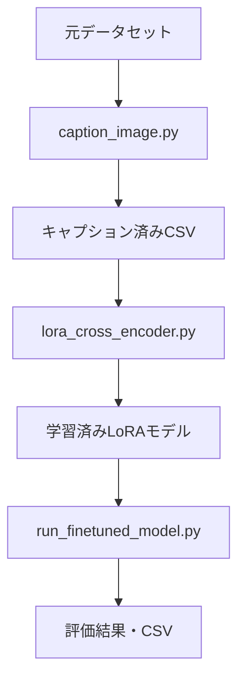

# Cross Encoder 実行スクリプト

日本語ユーモア評価システムのための実行可能スクリプト集

## 概要

このディレクトリには、クロスエンコーダーシステムの学習・評価・データ処理を行うための実行スクリプトが含まれています。
画像キャプション生成からLoRAファインチューニング、モデル評価まで、完全なパイプラインを提供します。

## ファイル構成

```
src/run/cross_encoder/
├── README.md                   # このファイル
├── caption_image.py            # 画像キャプション生成・データ処理
├── lora_cross_encoder.py       # LoRAファインチューニング実行
└── run_finetuned_model.py      # 学習済みモデルの評価
```

## 実行フロー



## スクリプト詳細

### 1. caption_image.py

画像データにキャプションを追加し、学習用データセットを準備するスクリプト

#### 機能
- **重複回避**: 同一画像の重複キャプション生成を防止
- **バッチ処理**: 効率的な画像キャプション生成
- **データ統合**: テキスト・画像データの統合
- **CSV出力**: 処理済みデータの保存

#### 使用方法
```bash
# GPU 1を使用してキャプション生成
uv run src/run/cross_encoder/caption_image.py
```

#### 出力
```
data/caption_processed/
├── train.csv        # 学習用データ（キャプション済み）
├── validation.csv   # 検証用データ（キャプション済み）
└── test.csv         # テスト用データ（キャプション済み）
```

#### 処理フロー
1. **データ読み込み**: 元データセット（train/validation/test）
2. **重複画像検出**: MD5ハッシュによる重複チェック
3. **キャプション生成**: Qwen2.5-VL-3B-Instructによる一括処理
4. **データ統合**: テキスト・画像データの結合
5. **CSV保存**: 処理済みデータの出力

#### 設定可能パラメータ
```python
# CUDAデバイス設定
os.environ['CUDA_VISIBLE_DEVICES'] = '1'

# バッチサイズ（メモリに応じて調整）
qwen_caption_client = QwenCaptionClient(batch_size=32)
```

#### 実行例
```bash
$ uv run src/run/cross_encoder/caption_image.py

データの読み込みを開始します...
データ数:
    train     : 8273
    validation: 2069
    test      : 2586

重複しない画像の抽出とキャプション生成を開始します...
重複画像の検出中...
重複を除いた画像数: 1247
キャプション生成中...
100%|████████| 40/40 [05:23<00:00,  8.09s/it]

各データセットにキャプションを適用します...
train:
validation:
test:

キャプション処理が完了しました。
結果は data/caption_processed にCSV形式で保存されました。
```

### 2. lora_cross_encoder.py

LoRAファインチューニングを実行するスクリプト

#### 機能
- **LoRA学習**: 効率的なファインチューニング
- **スコア正規化**: 学習用データの前処理
- **カスタム損失**: Sigmoid + MSE損失の適用
- **評価機能**: 学習中の性能監視

#### 使用方法
```bash
# LoRAファインチューニング実行
uv run src/run/cross_encoder/lora_cross_encoder.py
```

#### 入力データ
```
data/caption_processed/
├── train.csv        # 学習用データ
└── validation.csv   # 検証用データ
```

#### 出力
```
data/model/reranker-lora-finetuned/
└── final/
    ├── adapter_config.json
    ├── adapter_model.safetensors
    ├── config.json
    ├── special_tokens_map.json
    ├── tokenizer_config.json
    └── vocab.txt
```

#### 学習設定
```python
# LoRA設定
LoraConfig(
    task_type=TaskType.SEQ_CLS,
    r=8,                          # ランク
    lora_alpha=16,               # スケーリング係数
    lora_dropout=0.1,            # ドロップアウト
    target_modules=["query", "key", "value", "dense"]
)

# 学習設定
TrainingArguments(
    learning_rate=1e-5,          # 学習率
    per_device_train_batch_size=32,
    gradient_accumulation_steps=8,
    num_train_epochs=10,
    max_grad_norm=1.0,           # 勾配クリッピング
    fp16=not use_bf16,           # Mixed Precision
    bf16=use_bf16
)
```

#### データ前処理
```python
# スコア正規化（負の値を排除）
min_value = min(train_df['score'])
train_df['score'] = train_df['score'] - min_value
val_df['score'] = val_df['score'] - min_value
```

#### 実行例
```bash
$ uv run src/run/cross_encoder/lora_cross_encoder.py

trainable params: 1,572,864 || all params: 125,446,657 || trainable%: 1.2536

LoRAによるファインチューニングを開始します...
  0%|          | 0/1035 [00:00<?, ?it/s]
{'loss': 0.2847, 'grad_norm': 0.8432, 'learning_rate': 9.8e-06, 'epoch': 0.1}
  1%|▏         | 10/1035 [00:15<26:31,  1.55s/it]
...
学習済みLoRAアダプタを data/model/reranker-lora-finetuned/final に保存しました。
```

### 3. run_finetuned_model.py

学習済みモデルの評価とテスト実行スクリプト

#### 機能
- **モデル推論**: 学習済みLoRAモデルでの予測
- **多面的評価**: MSE、RMSE、R²、NDCGによる評価
- **データタイプ別評価**: テキスト・画像データの個別評価
- **結果保存**: 詳細な評価結果のCSV出力

#### 使用方法
```bash
# 学習済みモデルの評価実行
uv run src/run/cross_encoder/run_finetuned_model.py
```

#### 入力
- **テストデータ**: `data/caption_processed/test.csv`
- **学習済みモデル**: `data/model/reranker-lora-finetuned/final`
- **正規化用データ**: `data/caption_processed/train.csv`（最小値取得用）

#### 出力
```
data/cross_encoder/result/
├── test_predictions.csv       # 詳細予測結果
├── evaluation_metrics.csv     # 全体評価指標
└── evaluation_by_type.csv     # データタイプ別評価
```

#### 評価指標
- **MSE** (Mean Squared Error): 平均二乗誤差
- **RMSE** (Root Mean Squared Error): 平均二乗根誤差
- **R²** (R-squared): 決定係数
- **NDCG** (Normalized Discounted Cumulative Gain): ランキング品質

#### データ処理の安全性
```python
# データ整合性の確認
print(f"test_pairs数: {len(test_pairs)}")
print(f"test_scores数: {len(test_scores)}")

# ネストしたリストの平坦化
if test_scores and isinstance(test_scores[0], (list, tuple)):
    test_scores = [item for sublist in test_scores for item in sublist]

# 対応確認
for i in range(min(3, len(test_result_df))):
    original_pair = (test_result_df.iloc[i]['odai'], test_result_df.iloc[i]['response'])
    expected_pair = test_pairs[i]
    print(f"行{i}: {'✓' if original_pair == expected_pair else '✗'} 対応OK")
```

#### 実行例
```bash
$ uv run src/run/cross_encoder/run_finetuned_model.py

=== 推論結果 ===
test_pairs数: 2586
test_scores数: 2586
test_scores型: <class 'list'>
最終データ長: 2586

=== データ対応確認（最初の3件） ===
行0: お題='「このバッテリー、仲良すぎ」その理由とは？', 回答='電池同士が手を繋いでる', スコア=2.667, 予測=2.464
     ✓ 対応OK

=== 評価結果 ===
MSE: 1.0921
RMSE: 1.0451
R2: -0.4753
NDCG: 0.8524

=== テキストデータの評価 (n=1729) ===
MSE: 1.2685
RMSE: 1.1263
R2: -0.3503
NDCG: 0.8235

=== 画像データの評価 (n=857) ===
MSE: 0.7364
RMSE: 0.8581
R2: -1.3192
NDCG: 0.9348

詳細結果を data/cross_encoder/result/test_predictions.csv に保存しました。
評価指標を data/cross_encoder/result/evaluation_metrics.csv に保存しました。
データタイプ別評価結果を data/cross_encoder/result/evaluation_by_type.csv に保存しました。
```

## 実行環境

### 必要な依存関係
```bash
# 基本パッケージ
pip install torch transformers datasets pandas numpy scikit-learn tqdm

# PEFT (LoRA)
pip install peft

# 日本語処理
pip install fugashi unidic-lite

# Qwen Vision
pip install qwen-vl-utils
```

### GPU設定
```python
# 使用するGPUの指定
os.environ['CUDA_VISIBLE_DEVICES'] = "1"  # GPU 1を使用

# CUDA利用可能性の確認
if torch.cuda.is_available():
    print(f"CUDA利用可能: {torch.cuda.device_count()}個のGPU")
```

## 使用シナリオ

### 完全なパイプライン実行
```bash
# 1. 画像キャプション生成
uv run src/run/cross_encoder/caption_image.py

# 2. LoRAファインチューニング
uv run src/run/cross_encoder/lora_cross_encoder.py

# 3. モデル評価
uv run src/run/cross_encoder/run_finetuned_model.py
```

### 部分的な実行

#### キャプションのみ再生成
```bash
# 元データが更新された場合
uv run src/run/cross_encoder/caption_image.py
```

#### 学習設定変更後の再学習
```bash
# ハイパーパラメータ調整後
uv run src/run/cross_encoder/lora_cross_encoder.py
```

#### 異なるテストデータでの評価
```bash
# test.csvを変更後
uv run src/run/cross_encoder/run_finetuned_model.py
```

## パフォーマンス最適化

### メモリ効率化
```python
# バッチサイズの調整
caption_client = QwenCaptionClient(batch_size=16)  # メモリ不足時は削減

# 勾配蓄積
gradient_accumulation_steps=8  # 実効的なバッチサイズを増加
```

### 速度最適化
```python
# Mixed Precision
fp16=True  # または bf16=True

# 効率的なトークナイザー設定
padding_side='left'  # decoder-only model用
```

## トラブルシューティング

### よくある問題と解決策

#### 1. CUDA Out of Memory
```bash
# バッチサイズを減らす
QwenCaptionClient(batch_size=16)  # 32 → 16
per_device_train_batch_size=16    # 32 → 16
```

#### 2. キャプション生成が遅い
```bash
# GPU使用率確認
nvidia-smi

# バッチサイズ増加（メモリが許す範囲で）
QwenCaptionClient(batch_size=64)
```

#### 3. 学習が不安定
```python
# 学習率を下げる
learning_rate=5e-6  # 1e-5 → 5e-6

# 勾配クリッピング
max_grad_norm=0.5   # 1.0 → 0.5
```

#### 4. 評価結果が異常
```python
# データの対応確認
print("=== データ対応確認 ===")
# スクリプト内の対応確認ログを参照
```

#### 5. 依存関係エラー
```bash
# 日本語トークナイザー関連
pip install fugashi unidic-lite protobuf

# Qwen関連
pip install qwen-vl-utils
```

## ログとデバッグ

### 実行ログの確認
```bash
# 実行ログを保存
uv run src/run/cross_encoder/caption_image.py 2>&1 | tee caption_log.txt
uv run src/run/cross_encoder/lora_cross_encoder.py 2>&1 | tee training_log.txt
uv run src/run/cross_encoder/run_finetuned_model.py 2>&1 | tee evaluation_log.txt
```

### デバッグモード
```python
# より詳細な出力
import logging
logging.basicConfig(level=logging.DEBUG)

# プログレスバーの詳細表示
from tqdm import tqdm
tqdm.pandas()
```

## ベストプラクティス

### 1. データ管理
- 各ステップでの中間結果を保存
- バックアップの定期作成
- バージョン管理の活用

### 2. リソース管理
- GPU使用率の監視
- メモリ使用量の最適化
- バッチサイズの適切な設定

### 3. 実験管理
- ハイパーパラメータの記録
- 評価結果の比較
- 再現性の確保

### 4. エラーハンドリング
- 中断可能な処理の設計
- チェックポイントの活用
- ログの適切な出力

## 関連ドキュメント

- **モデル仕様**: `src/model/cross_encoder/README.md`
- **データセット仕様**: `src/dataloader/README.md`
- **プロジェクト概要**: プロジェクトルートのREADME.md